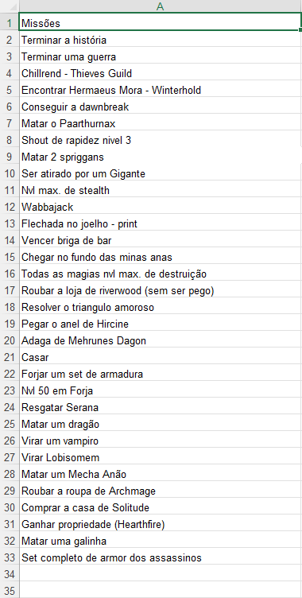

# Bingo!
> Challenge your friends with a competition!

Before the game starts, the group must choose up to 25 challenges, and mannualy insert it into an Excel sheet. This is the funniest part.

### E.g.

## Installation

<ol>
    <li>Install Python and a CLI (Pycharm or Visual Studio Code is strongly recommended) on your computer</li> 
    <li>Create a virtual environment using the comand on your terminal</li>
    <code>python3 -m venv venv</code>  
    <li>Activate it
      
    <strong>- On Windows</strong>
     
    <code>venv/Scripts/Activate.bat</code>
      
    <strong>- On Linux</strong>
     
    <code>source venv/bin/activate</code>
      
    </li>
    <li>Download all the lib using the command line
    <code>pip install -r requirements.txt</code>
    in your terminal
    </li> 
    <li>Download the Project and past it where the virtual enviroment is installed</li>
</ol>

## How to use it

<ol>
    <li>Open your CLI</li> 
    <li>Then open the folder where you decided to put the script</li> 
    <li>In Your CLI, click the "play" button and done!</li> 
    <li>EXTRA: open the main.py file</li>
    <lu>if you want, you can modify the script here
     
    - Line 6 = name of your list of challenges (list_chl.xlsx)
     
    - Line 26 = numbers of challegens the group want to do
    </lu>
</ol>

## Meta 
 

## Guilherme Bracero Gonzales 

 
LinkedIN - [Guilherme Bracero](https://www.linkedin.com/in/guilherme-bracero/)
 
Instagram - [Bracero](https://instagram.com/guilhermebracero)
 
Email - [guibragon@gmail.com](www.gmail.com) 
